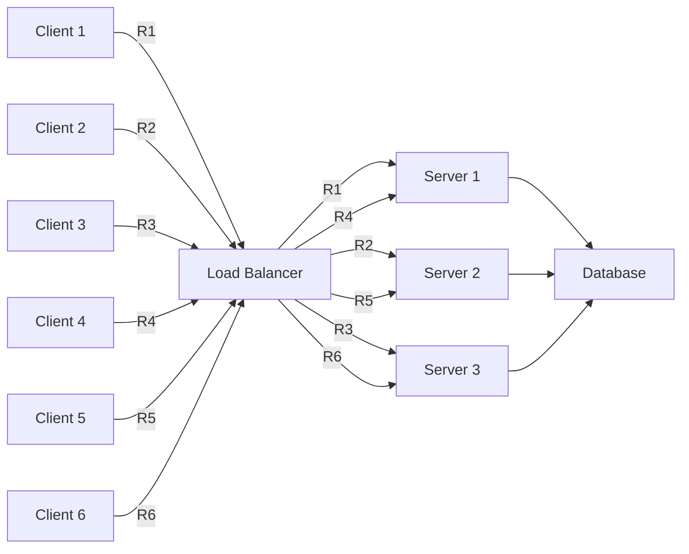
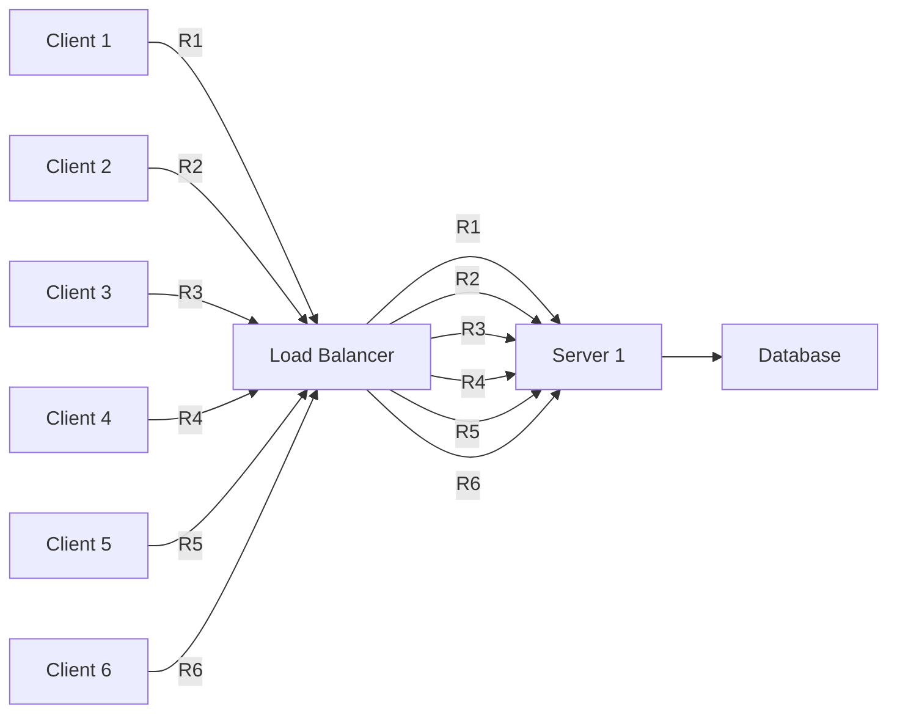

Scalability is a crucial aspect of any system. As the user base grows, the system should be able to handle the increased load without compromising performance. Here are some key points to consider when designing scalable systems:

1. **Load Balancing**: Distribute incoming traffic across multiple servers to ensure no single server is overwhelmed.
2. **Horizontal Scaling**: Add more servers to the system to handle increased load.
3. **Vertical Scaling**: Increase the capacity of existing servers by adding more resources (CPU, memory, etc.).

Horizontal scaling with load balancer with 6 clients 3 servers and a database:
    

Vertical scaling with load balancer with 6 clients 1 server and a database:
    

    

