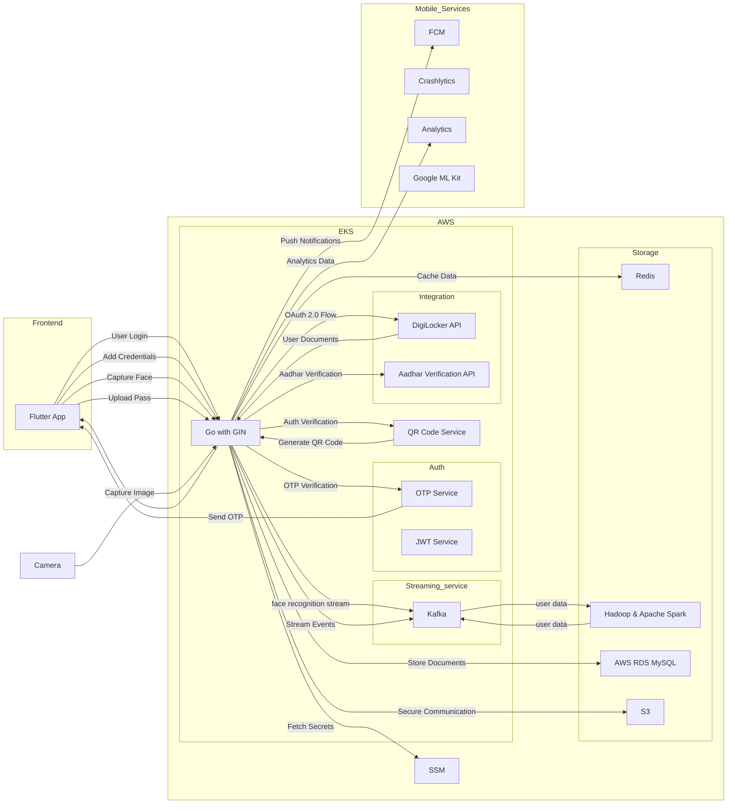

After going through some resources, I got an Idea of how digiyatra is working and what are the components involved in it. I have tried to create a high level design of the system.

There might be some components missing or some components might not be required. This is just a high level design of the system.
I would like to know your thoughts on this.
