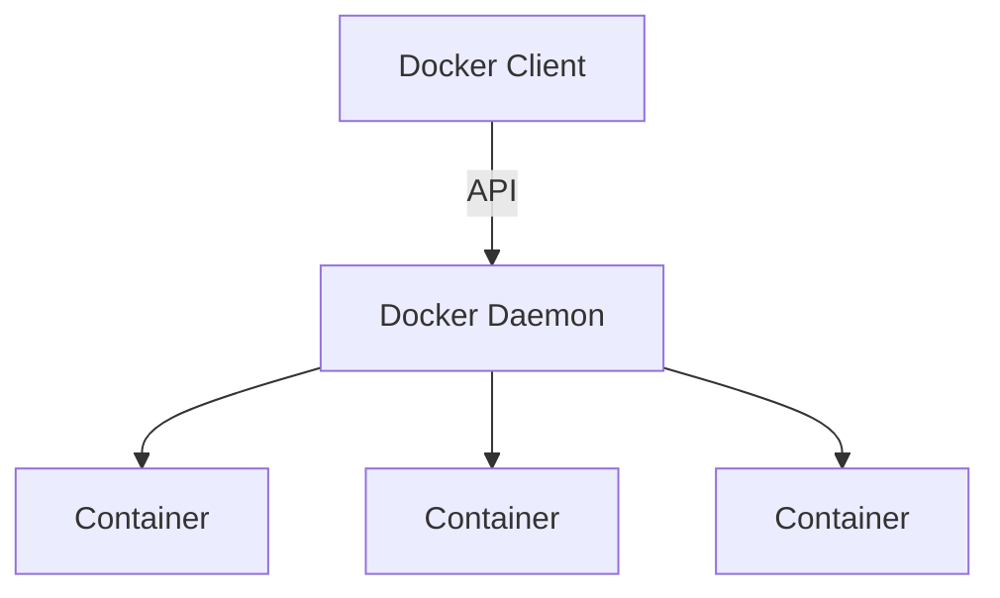

## Docker 

Docker is a platform for developers and sysadmins to develop, deploy, and run applications with containers. The use of Linux containers to deploy applications is called containerization. Containers are not new, but their use for easily deploying applications is.

Containers are a way to package software in a format that can run isolated on a shared operating system. Unlike VMs, containers do not bundle a full operating system - only libraries and settings required to make the software work are needed. This makes for efficient, lightweight, self-contained systems and guarantees that software will always run the same, regardless of where it’s deployed.

### Docker Architecture with mermaid diagram



### Docker installation

Docker can be installed on Windows, Mac and Linux. The installation steps are available in the below link.

### Docker Commands

```bash
docker --version
docker run hello-world
docker ps
docker ps -a
docker images
docker pull <image-name>
docker run -it <image-name>
docker compose up
docker compose down
docker build -t <image-name> .
docker push <image-name>
docker tag <image-name> <new-image-name>
```

### Lets create a simple docker image with NestJS"

#### Step 1: Create a NestJS application

```bash
npm i -g @nestjs/cli
nest new nestjs-app
cd nestjs-app
npm run start:dev
```

#### Step 2: Create a Dockerfile

```yaml
FROM node:20-alpine
WORKDIR /app
COPY package.json ./
RUN npm install
COPY . .
CMD ["npm", "run", "start:dev"]
```

#### Step 3: Build and run the docker image

```bash
docker build -t nestjs-app .
docker run -p 3000:3000 nestjs-app
```

#### Step 4: check the application in browser

```bash
http://localhost:3000
```

